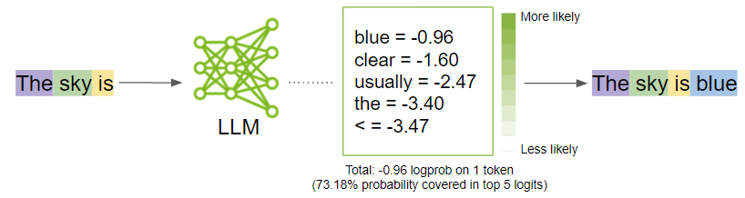

# **Nya - a Compute Subnet** <!-- omit in toc -->

*Nya [means](https://www.thebump.com/b/swahili-baby-names) purpose in Swahili*

by **Nakamoto Mining**, with the support of **Commune AI**

 

[CommuneAI Discord](https://discord.gg/communeai) 

 

---

Training models like ChatGPT and Llama costs approximately $300 million, requiring billion-dollar datacenters. This expense is a significant barrier for many researchers. Inspired by initiatives like [Folding at Home](https://foldingathome.org/) and [Learning at Home](https://github.com/learning-at-home/hivemind), we envision a decentralized network that democratizes AI research and development through a shared mission and **purpose**. 

During the global pandemic, Folding at Home saw such an influx of participants that its computing power exceeded the world's largest supercomputers. Recognizing this potential, we are developing technology to enable the decentralized training of large models, benefiting all participants. We believe that the network's value will grow as more participants join and as we continue to release new models and technologies. 

Please refer to the guide on how to [run a miner](docs/run_a_miner.md) to get started. For more technical details, refer to the [white paper](docs/white_paper.md).

## Table of Contents

1. [Overview](#Overview)
2. [Current Task: Knowledge Distillation](#task)
3. [Frequently Asked Questions](#faq)
4. [Future Plans](#future)

## Overview

In this subnet, miners are rewarded for completing assigned tasks, which involve machine learning computations instead of solving cryptographic puzzles like in Bitcoin mining. The results are validated to ensure correctness and maintain network integrity. Rewards are distributed based on each miner's share of the total computation performed, meaning the more computation a miner completes, the more rewards they receive.

Since the validation process is entirely objective, YUMA consensus is irrelevant. A private, central validator will assign tasks and validate the computation results. The outputs of all miners will be validated through a multistep process with redundancy, involving multiple miners.

## Current Task: Knowledge Distillation <a name="task" />

[Knowledge distillation][kd] 
is the process of transferring knowledge from a large model to a smaller one. A Large Language Model (LLM) is a probabilistic model trained on vast datasets to assign probabilities to sequences of tokens. In KD, there are two important concepts: "hard labels" and "soft labels." Hard labels are the actual data or the true labels from the dataset, while soft labels are the probabilities assigned to each possible output by the LLM, capturing the model's uncertainty and the relative likelihood of different classes. Training the smaller model on these soft labels provides a richer, more efficient and nuanced training signal, allowing it to better mimic the larger model's performance and enhance its generalization and accuracy.

Consider the following example:

*Source: [NVIDIA Developer Blog](https://developer.nvidia.com/blog/how-to-get-better-outputs-from-your-large-language-model/)*

If we were to train an LLM on "The sky is blue", the forth token "blue" would be considered the only correct token. At the same time, we know there are other possible tokens that could follow "The sky is," such as "clear", "beautiful", "cloudy", "dark", etc. With KD, we can capture signals other than the hard label "blue" and use them to train a smaller student model. As a result, we expect to have more efficient training and better generalization.

Now, given a pre-trained model as teacher and a dataset, one can precompute and cache the teacher's outputs. Such outputs can be used for improving efficiency and reducing the computational cost of future training tasks. We have selected [Phi-3-medium-4k-instruct](https://huggingface.co/microsoft/Phi-3-medium-4k-instruct) as the teacher. Phi-3, is a family of models released by Microsoft under MIT License that rivals models such as Mixtral 8x7B and GPT-3.5. 

As for the dataset, we plan to start with [C4](https://huggingface.co/datasets/allenai/c4), a colossal, cleaned version of Common Crawl for the first release. In the future, we plan to switch to [FineWeb](fineweb-blog), the largest (+15 trillion tokens, 100 TB of text) and finest open source dataset available.  

The precomputed teacher outputs collected in this subnet will be periodically released to the public under MIT License. These outputs can be used for future training tasks.

For more information on KD, refer to [Neptune AI](https://neptune.ai/blog/knowledge-distillation), [DistilBERT](https://arxiv.org/abs/1910.01108), [Pytorch Tutorial](https://pytorch.org/tutorials/beginner/knowledge_distillation_tutorial.html), and [roboflow](https://blog.roboflow.com/what-is-knowledge-distillation/).

## Frequently Asked Questions <a name="faq" />

- I want to customize the model and the dataset. How can I do that?
  + You cannot customize the model, dataset, or the task in this subnet. You can join other subnets if you prefer to customize these components. 
- I want to run a validator. How can I do that?
  + At this moment, we are not supporting running a validator. We will work with the participants to ensure subnets' parameters are set 
- What is the registration fee for the subnet?
  + Starting registration fee is set to 10 tokens, we plan to remove this fee once early testing is completed.
- I like this project. How can I contribute?
  + Aside from participating as a miner, feel free to review the miner's code and suggest improvements. Furthermore, if you have any ideas or suggestions, please share them with our team.

## Future Plans <a name="future" />

In the future, subnet stakeholders will be able to vote on the network's direction and the features to be developed. They can request models for specific tasks, and the subnet will facilitate the training of these models.

## To Do

- [ ] Add more details on future plans and phases
- [ ] Add weights and biases monitoring for the miner
- [ ] Add leaderboard

[swarm]: https://proceedings.mlr.press/v202/ryabinin23a/ryabinin23a.pdf
[zero]: https://arxiv.org/abs/1910.02054
[kd]: https://arxiv.org/abs/1503.02531
[fineweb-blog]: https://huggingface.co/spaces/HuggingFaceFW/blogpost-fineweb-v1

